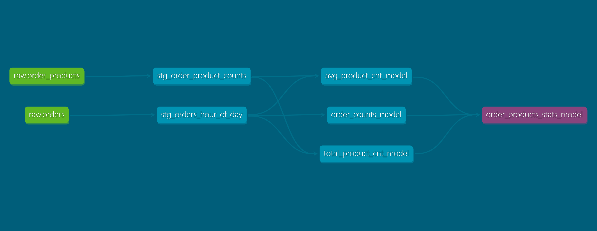

# dbt PostgreSQL Project with Instacart Dataset

A complete dbt (data build tool) development environment with PostgreSQL database and real-world Instacart Market Basket Analysis dataset, containerized using Docker Compose.

## Project Structure

```
├── test_dbt_project/          # Main dbt project directory
│   └── test_dbt_project/
│       ├── models/            # dbt models (SQL transformations)
│       ├── tests/             # Data quality tests
│       ├── macros/            # Reusable SQL macros
│       ├── seeds/             # CSV files for reference data
│       └── dbt_project.yml    # Project configuration
├── initdb/                    # Database initialization files
│   ├── pre-seed.sql          # Creates tables and loads CSV data
│   ├── aisles.csv            # Product aisles (134 categories)
│   ├── departments.csv       # Store departments (21 departments)
│   ├── products.csv          # Product catalog (~50k products)
│   ├── orders.csv            # Customer orders (~3.4M orders)
│   ├── order_products__*.csv # Order line items (~33M records)
├── .dbt/
│   └── profiles.yml           # Database connection profiles
├── docker-compose.yml         # Docker services configuration
├── download-instacart-data.sh # Script to download Instacart dataset
├── .env                       # Environment variables
└── requirements.txt           # Python dependencies
```

## Dataset

This project uses the **Instacart Market Basket Analysis** dataset, which contains real e-commerce data including:

- **Orders**: 3.4M grocery orders from 200k+ users
- **Products**: 50k products across 134 aisles and 21 departments  
- **Order Products**: 33M order line items with reorder patterns
- **User Behavior**: Order timing, frequency, and shopping patterns

The dataset is automatically loaded into a `raw` schema with proper relationships and foreign keys.

## Services

- **PostgreSQL 17**: Main database (port 5433)
- **dbt-postgres**: dbt transformation engine (port 8080 for docs server)
- **pgAdmin**: Database management interface (port 5050)

### dbt Service Configuration

The dbt service has been customized to run continuously in the background:

- **Entrypoint Override**: Changed from the default `dbt` entrypoint to `/bin/sh -c` to allow custom commands
- **Command**: Uses `tail -f /dev/null` to keep the container running indefinitely without consuming resources
- **Port Mapping**: Exposes port 8080 for the dbt documentation web server

This configuration allows you to execute dbt commands on-demand via `docker exec` while keeping the container available for interactive use and documentation serving.

## Quick Start

1. **Download the Instacart dataset (optional - data is included):**
   ```bash
   ./download-instacart-data.sh
   ```
   
2. **Start the services:**
    ```bash
    docker compose up --detach
    ```

3. **Initialize dbt project (if needed):**
   ```bash
   docker container exec --tty --interactive dbt dbt init test_dbt_project
   ```

The PostgreSQL container will automatically:
- Create the `raw` schema
- Load all CSV files into database tables
- Set up proper relationships and indexes


## dbt Commands

### Install Dependencies
Installs packages defined in packages.yml (dbt packages, macros, and utilities from dbt Hub or Git). Run this before building models if using external packages:
```bash
docker container exec --tty --interactive dbt dbt deps --project-dir /usr/app/test_dbt_project
```

### Generate Source Template
Automatically generates a sources.yml file by introspecting database tables. Creates source definitions with columns, data types, and descriptions for all tables in the specified schema. Requires dbt_codegen package:
```bash
docker container exec --tty --interactive dbt dbt --quiet run-operation generate_source --args '{"database_name": "dbt", "include_descriptions": True, "schema_name": "raw", "generate_columns": True, "include_data_types": True, "include_database": True, "include_schema": True}' --project-dir /usr/app/test_dbt_project > test_dbt_project/test_dbt_project/models/_sources.yml
```

### Generate Base Model
Creates a base model SQL file that selects all columns from a source table. Useful for creating staging models with proper column selection and aliasing. Requires dbt_codegen package:
```bash
docker container exec --tty --interactive dbt dbt run-operation generate_base_model --args '{"source_name": "raw", "table_name": "orders"}' --project-dir /usr/app/test_dbt_project
```

### Build Models
Compiles and executes all dbt models, creating tables and views in PostgreSQL according to your model definitions:
```bash
docker container exec --tty --interactive dbt dbt run --project-dir /usr/app/test_dbt_project
```

### Run Tests
Executes all configured data quality tests (uniqueness, null checks, data consistency). Tests validate data without modifying it:
```bash
docker container exec --tty --interactive dbt dbt test --project-dir /usr/app/test_dbt_project
```
Or execute singular (custom) tests:
```bash
docker container exec --tty --interactive dbt dbt test --project-dir /usr/app/test_dbt_project --select 'test_type:singular'
```
Or execute data quality tests on sources:
```bash
docker container exec --tty --interactive dbt dbt test --project-dir /usr/app/test_dbt_project --select source:raw
```

### Full Refresh
Drops and recreates all tables/materialized views instead of incremental updates. Useful after major model changes:
```bash
docker container exec --tty --interactive dbt dbt run --project-dir /usr/app/test_dbt_project --full-refresh
```

### Interactive Shell
Access the dbt container for debugging, running multiple commands, or exploring the environment:
```bash
docker container exec --tty --interactive dbt /bin/bash
```

### Compile a Model
Compiles a specific model into SQL without executing it. Useful for debugging and validating SQL syntax before running:
```bash
docker container exec --tty --interactive dbt dbt compile --project-dir /usr/app/test_dbt_project --select models/model.sql
```

### Run a Specific Model
Executes a single compiled model instead of all models. Faster for iterative development and testing individual transformations:
```bash
docker container exec --tty --interactive dbt dbt run --project-dir /usr/app/test_dbt_project --select models/model.sql
```

### Generate Documentation
Generates project documentation including model lineage, column descriptions, and data flow diagrams. Creates static HTML files:
```bash
docker container exec --tty --interactive dbt dbt docs generate --project-dir /usr/app/test_dbt_project
```

### Serve Documentation
Starts a local web server to view generated documentation in your browser. Access at http://localhost:8080:
```bash
docker container exec --tty --interactive dbt dbt docs serve --project-dir /usr/app/test_dbt_project --host 0.0.0.0
```
Or run the command in detached mode:
```bash
docker container exec --detach dbt dbt docs serve --project-dir /usr/app/test_dbt_project --host 0.0.0.0
```

### Check Source Freshness
Validates that source data is up-to-date based on freshness thresholds defined in sources.yml. Reports warnings or errors if data is stale:
```bash
docker container exec --tty --interactive dbt dbt source freshness --project-dir /usr/app/test_dbt_project
```


## Database Access

- **pgAdmin**: http://localhost:5050
- **PostgreSQL**: localhost:5433
- **Credentials**: Check `.env.example` file

## Database Schema

The `raw` schema contains the following tables:

- `raw.aisles` - Product categories (aisle_id, aisle)
- `raw.departments` - Store departments (department_id, department)  
- `raw.products` - Product catalog with aisle/department references
- `raw.orders` - Customer orders with timing and user info
- `raw.order_products` - Order line items with reorder flags

## Development

The project includes example models demonstrating:
- Basic data transformations
- Model references using `{{ ref() }}`
- Data quality tests
- Model materialization strategies

Start by modifying files in `test_dbt_project/test_dbt_project/models/` or create new ones following dbt conventions.

**Example Analytics Use Cases:**
- Customer segmentation and lifetime value
- Product recommendation systems
- Market basket analysis
- Reorder prediction models
- Sales forecasting and trends

## Environment Variables

Configure database connection and ports in `.env`:
- `POSTGRES_USER`, `POSTGRES_PASSWORD`, `POSTGRES_DB`
- `POSTGRES_PORT`, `PGADMIN_PORT`, `DBT_POSTGRES_PORT`
- `DBT_HOST_PROJECT_DIR`, `DBT_HOST_PROFILES_FILE`, `DBT_WORKDIR`, `DBT_SERVER_PORT`

## Project Overview

As for now this dbt project analyzes order and product data to generate hourly statistics.

### Data Lineage



The project follows this data flow:
- **Sources**: Raw order and order_products tables
- **Staging**: Extracts order hour from timestamps (stg_orders_hour_of_day, stg_order_product_counts)
- **Intermediate models**:
  - `order_counts_model`: Order counts by hour
  - `avg_product_cnt_model`: Average products per order by hour
  - `total_product_cnt_model`: Total products by hour
- **Final model**: `order_products_stats_model` combines all metrics with rolling aggregations
